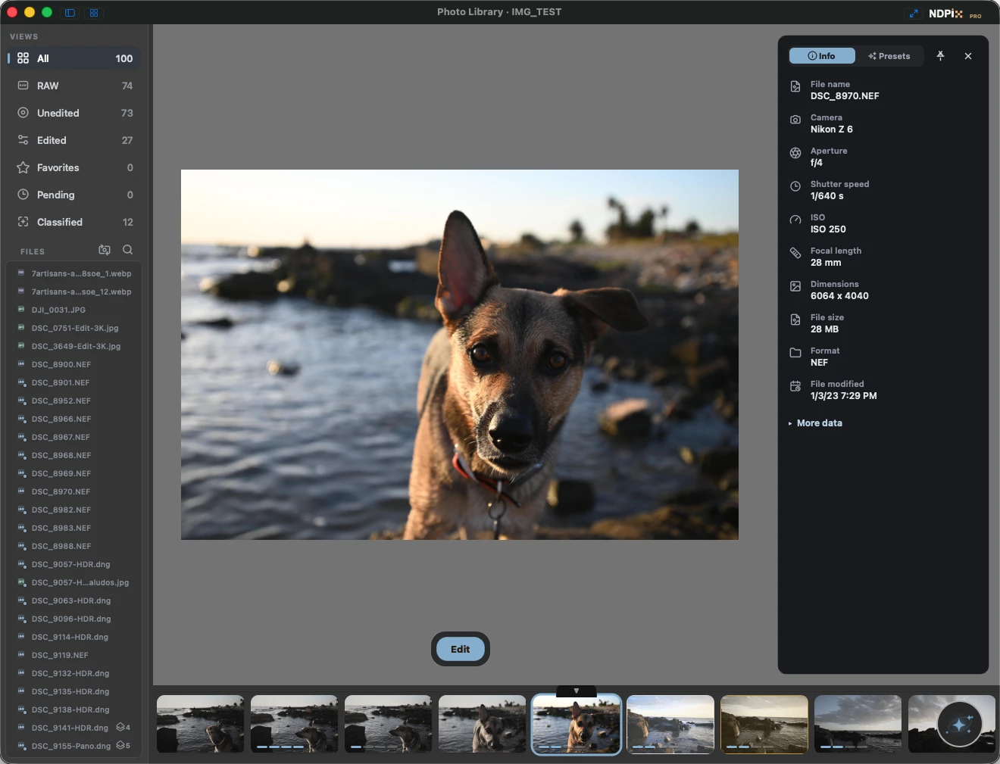
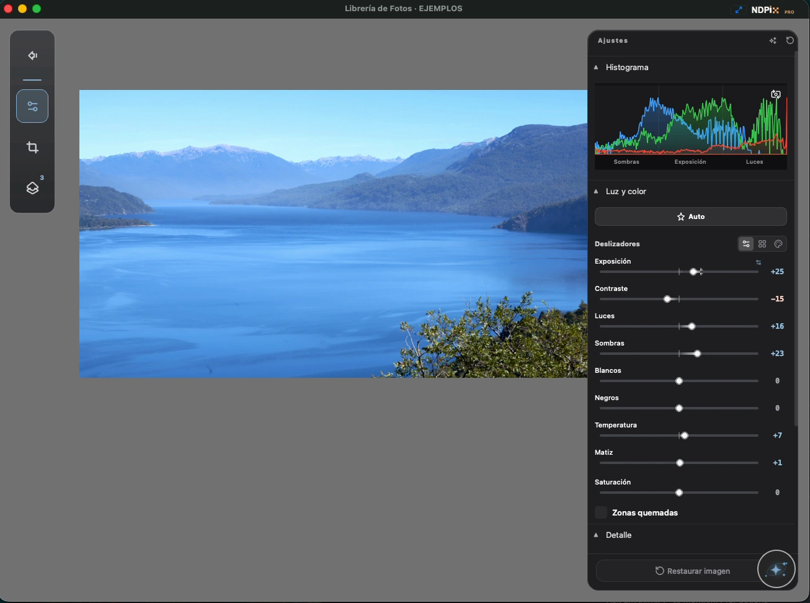
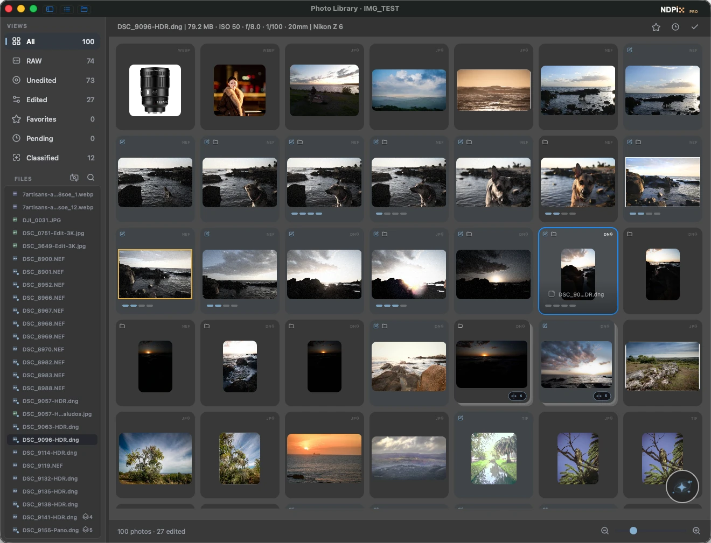

<div align="center">

# NDPix Releases

**A focused desktop RAW photo editor and digital asset manager made by a photographer for photographers.**  
*Organize, develop, and export your photos without friction. Your originals are never touched.*

[](#system-requirements)
[-000000.svg?logo=apple)](#system-requirements)
[%20%2F%2011%20(64--bit)-0078D6.svg?logo=windows)](#system-requirements)
[](#third-party-source-disclosure)
[](#privacy--core-values)

<p align="center">
  <a href="#downloads"><strong>Download Latest Release</strong></a> •
  <a href="https://nicodottaphoto.com/ndpix-photo-editor/"><strong>Official Website</strong></a> •
  <a href="#key-features"><strong>Key Features</strong></a> •
  <a href="#system-requirements"><strong>System Requirements</strong></a> •
  <a href="#third-party-source-disclosure"><strong>Source Disclosure</strong></a>
</p>

</div>

---

<p align="center">
  
</p>

## Overview

**NDPix** is built from years of real-world photography experience in the field and at the desk. Unlike cloud-tethered or bloated editors, NDPix runs **100% offline**, never touches your original RAW or raster files, and delivers a calm, responsive, desktop-first workspace designed to keep you in the flow.

- 🌐 **Official Website:** [nicodottaphoto.com/ndpix-photo-editor](https://nicodottaphoto.com/ndpix-photo-editor/)
- 📦 **Releases & Binary Hosting:** [github.com/nicodotta/ndpix-releases/releases](https://github.com/nicodotta/ndpix-releases/releases)

---

## Downloads

Download the latest version directly from GitHub Releases:

👉 **[Browse All Published Releases](https://github.com/nicodotta/ndpix-releases/releases)**

### Recommended Packages for End Users

| Platform | Recommended Download | Target Architecture | System Requirements |
| :--- | :--- | :--- | :--- |
| **macOS** | **`NDPix-<version>.dmg`** | Universal (`arm64` Apple Silicon + `x86_64` Intel) | macOS 14 (Sonoma) or newer |
| **Windows** | **`NDPixSetup-<version>.exe`** | 64-bit (`x64`) | Windows 10 (version 1809+) or Windows 11 |

* **macOS Installation:** Open `NDPix-<version>.dmg` and drag the **NDPix** icon into your `Applications` folder.  
* **Windows Installation:** Run `NDPixSetup-<version>.exe` and follow the setup wizard.

<details>
<summary><strong>Windows SmartScreen Tip (First-time launch)</strong></summary>

Because newly released builds may not have accumulated download reputation immediately with Microsoft SmartScreen, Windows Defender may display a warning:
1. In your browser's download shelf, click the `...` menu next to `NDPixSetup.exe` → select **Keep** → **Show more** → **Keep anyway**.
2. If Windows displays *"Windows protected your PC"* when launching: click **More info** → **Run anyway**.
3. *Always verify that the downloaded installer begins with `NDPixSetup-`, ends in `.exe`, and comes directly from this repository or nicodottaphoto.com.*
</details>

### Automated Updater Packages (Technical)

The assets also include `.zip` archives consumed automatically by the background desktop updater:
- `NDPix-macos.zip`: Technical payload used by the macOS in-app updater.
- `NDPix-windows.zip`: Technical payload used by the Windows in-app updater.
- `NDPix-windows-legacy.zip`: Migration bridge for upgrading older Windows installations.

*(Manual downloads or new installations should always use the `.dmg` or `.exe` installers above).*

---

## Key Features

<p align="center">
  
</p>

### 🛡️ Your Originals are Sacred
* **100% Non-destructive editing:** Your RAW and raster files are never modified. Edits are recorded cleanly in an ACID SQLite database and industry-standard `.xmp` sidecars.
* **Side-by-side Before/After:** Instant 60 FPS split comparator with draggable slider.
* **Exposure clipping alerts & Live RGB Histogram.**

### 🎨 Develop with Feel, Not Formulas
* **Precision light & tone control:** Responsive sliders for Exposure, Contrast, Highlights, Shadows, Whites, and Blacks.
* **8-Channel Color Mixer:** Independent Hue, Saturation, and Luminance (HSL) adjustments.
* **2D Visual Color & Tone Pads:** Direct, intuitive adjustments with single gestures.
* **Geometry & Horizon:** One-click auto horizon straightening, fluid 60 FPS rotation with auto-inscribed cropping.
* **Film character & creative presets:** Authentic grain simulation, vignette, Tri-X inspired creative presets, and batch recipe application.

### 🎯 Smart Masks & Retouching
* **AI Subject Selection:** Automatic subject cutout powered by local MobileSAM segmentation.
* **Layered Local Masks:** Brush (with flow & hardness), linear gradients, radial gradients, and luminance range masks.
* **Dodge & Burn and Tinting:** Natural local lighting and color refinement.
* **Inpainting Spot Removal:** Telea, Navier-Stokes, and neural LaMa inpainting to seamlessly eliminate sensor dust, cables, and distractions.

### 📂 Organization Without Friction

<p align="center">
  
</p>
* **Zero-import workflow:** Open any folder on your drive or memory card instantly — no long catalog import steps.
* **Smart Culling & Burst Clustering:** Automatic burst detection, sharpness evaluation (Laplacian variance), 0–5 star ratings, and Pick/Reject flags.
* **HDR Fusion:** Exposure bracketing merge in 32-bit float with deghosting.

### 🖼️ Presentation & Export
* **Export Formats:** High-resolution export to JPEG, PNG, and 16-bit TIFF with full photographic EXIF & XMP metadata preservation.
* **Watermarking & Presentation Frames:** Add custom text signatures (position, size, opacity, color) and customizable presentation borders.
* **Batch Processing:** Copy recipes across multiple photos or entire sessions.

### 🔒 100% Offline, Private & Multilingual
* Runs locally on your machine — zero network calls required for editing. Your photos remain on your computer.
* Available in **7 languages**: English, Spanish, Portuguese, French, German, Japanese, and Simplified Chinese.
* Clean dark, gray, and light themes.

---

## Checksums and Verification

Every published binary and source archive includes a corresponding `.sha256` hash file. To verify:

```bash
# macOS (Terminal)
shasum -a 256 -c NDPix-<version>.dmg.sha256

# Windows (PowerShell)
Get-FileHash .\NDPixSetup-<version>.exe -Algorithm SHA256
```

---

## Third-Party Source Disclosure

NDPix is proprietary commercial software. This repository does not publish the NDPix application source code.

In compliance with open-source licenses governing third-party libraries dynamically linked with NDPix (such as GNU LGPL v3.0 and CDDL 1.0):
* The [`source-disclosure/`](./source-disclosure/) directory records the source disclosure manifest (`source-disclosure-manifest.json`) and replacement instructions for each release.
* Upstream source archives for covered libraries (including Qt 6 submodules and LibRaw) and their matching `.sha256` files are published as downloadable assets under each [GitHub Release](https://github.com/nicodotta/ndpix-releases/releases).
* Full legal notices and source offers are included inside the application bundle (`Contents/Resources/legal/` on macOS, `legal/` on Windows) and accessible via **About > Open Source Notices**.

---

## Support & Links

* 🌐 **Official Website:** [nicodottaphoto.com/ndpix-photo-editor](https://nicodottaphoto.com/ndpix-photo-editor/)
* 📖 **Installation Guide:** [Illustrated Setup Guide](https://nicodottaphoto.com/es/ndpix-photo-editor-installation)
* 📬 **Contact & Feedback:** [nicodottaphoto.com/contact](https://nicodottaphoto.com/contact/)
* 📷 **Author:** [@nicodottaphoto](https://instagram.com/nicodottaphoto)
